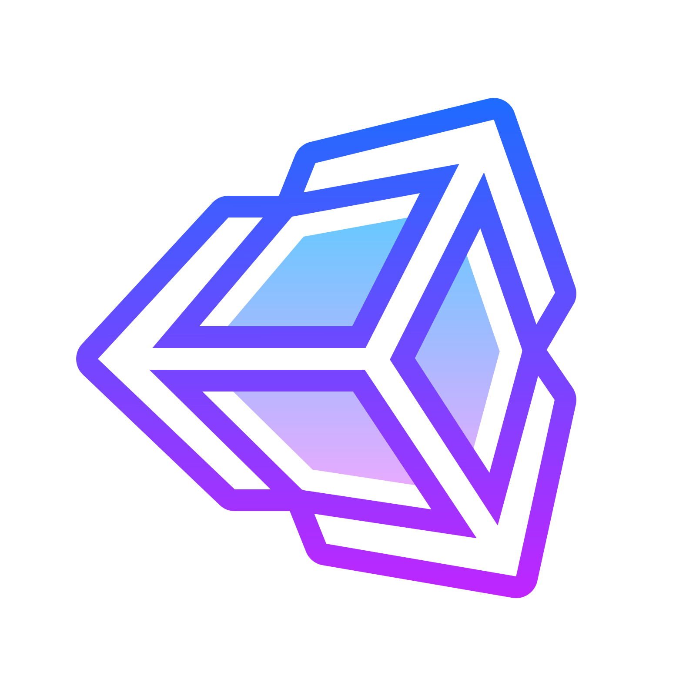

### 
<!--
**Heemo2000/Heemo2000** is a ✨ _special_ ✨ repository because its `README.md` (this file) appears on your GitHub profile.

Here are some ideas to get you started:

- 🔭 I’m currently working on ...
- 🌱 I’m currently learning ...
- 👯 I’m looking to collaborate on ...
- 🤔 I’m looking for help with ...
- 💬 Ask me about ...
- 📫 How to reach me: ...
- 😄 Pronouns: ...
- ⚡ Fun fact: ...
-->

<table>
  <tr>
    <td>
      <h1>
      

      Hi there 👋, I'm Himanshu Gupta.
      

      </h1>
      

        
      

      

      &nbsp;&nbsp;&nbsp;&nbsp;
      &nbsp;&nbsp;&nbsp;&nbsp;
      &nbsp;&nbsp;&nbsp;&nbsp;
      
      

    </td>
  </tr>
</table>

### 👔 <ins>About Me:</ins>

<table>
  <tr>
    <td>
      <ul>
        <li>I am a game programmer currently learning Unity and Unreal engine.
        <li>Interested mainly in game programming and little bit of game engine programming.
        <li>Have little bit of experience in OpenGL graphics API.
      </ul>
    </td>
  </tr>
</table>

  &nbsp;&nbsp;&nbsp;&nbsp;&nbsp;&nbsp;&nbsp;&nbsp;
    

### 🔧 <ins>Skills:</ins>

<table>
  <tr>
    <td>
      

      <table>
        <tr>
          <th>
Programs
</th>
          <td>
            &nbsp;&nbsp;&nbsp;&nbsp;
            &nbsp;&nbsp;&nbsp;&nbsp;
            &nbsp;&nbsp;&nbsp;&nbsp;
            &nbsp;&nbsp;&nbsp;&nbsp;
            &nbsp;&nbsp;&nbsp;&nbsp;
          </td>
        </tr>
        <tr>
          <th>
Languages
</th>
          <td>
            &nbsp;&nbsp;&nbsp;&nbsp;
            &nbsp;&nbsp;&nbsp;&nbsp;
            &nbsp;&nbsp;&nbsp;&nbsp;
            &nbsp;&nbsp;&nbsp;&nbsp;
          </td>
        </tr>
        <tr>
          <th>
APIs
</th>
          <td>
            &nbsp;&nbsp;&nbsp;&nbsp;
          </td>
        </tr>
        <tr>
          <th>
Utilities
</th>
          <td>
            &nbsp;&nbsp;&nbsp;&nbsp;
          </td>
        </tr>
      </table>
      

    </td>
   </tr>
</table>
